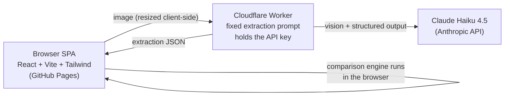

# TTB Label Verifier

AI-powered prototype that checks an alcohol beverage label image against its COLA application data — brand name, class/type, alcohol content, net contents, producer, country of origin, and a character-exact check of the mandatory government health warning statement.

**Live app:** https://shoyu-ramen.github.io/ttb-label-verifier/

Built for the Treasury take-home assessment ("AI-Powered Alcohol Label Verification App"). See [APPROACH.md](APPROACH.md) for design decisions, requirement traceability, assumptions, and trade-offs.

## What it does

- **Check a label** — drop in a label image, enter what the application says, get a verdict in ~3–5 seconds: green (matches), yellow (needs human review), red (problems found), with an extracted-vs-expected side-by-side for every field and a plain-language explanation of each problem.
- **Check a batch** — upload hundreds of label images at once, optionally with a CSV of application data keyed by filename (template downloadable in the app). Results stream in as a table with per-label verdicts and timing, and can be exported to CSV.
- **Try a sample** — eight bundled test labels covering the cases agents actually catch: a title-case government warning, a reworded warning, a missing warning, a wrong ABV, a brand-name capitalization difference (which correctly *passes* with a note), an imported wine, and a blurry angled photo.

## Architecture



- **`web/`** — static React SPA. The comparison logic (`web/src/lib/compare.ts`, `warning.ts`) is deterministic, pure TypeScript, and unit-tested; the AI is used only to *read* the label, never to decide compliance.
- **`worker/`** — a purpose-built Cloudflare Worker that accepts a label image, runs a pinned extraction prompt against the Anthropic API (`claude-haiku-4-5` for speed), and returns structured JSON. The API key lives only in the Worker; CORS is restricted to the app's origin. It is not a general-purpose proxy.
- **Nothing is stored.** No database, no uploads at rest, no PII retention — images are processed in memory and discarded.

## Run it locally

Prereqs: Node 20+, an Anthropic API key.

```bash
npm install

# 1. Start the Worker (terminal 1)
echo 'ANTHROPIC_API_KEY=sk-ant-...' > worker/.dev.vars
npm run dev:worker        # http://localhost:8788

# 2. Start the web app (terminal 2)
npm run dev               # http://localhost:5173
```

Open http://localhost:5173, go to **Try a sample**, and click any label.

## Tests

```bash
npm test
```

27 unit tests cover the comparison engine: warning exactness (title-case prefix, rewording, truncation, missing), ABV/proof parsing and cross-checking, net-contents unit normalization, brand-name formatting tolerance, and low-confidence handling.

## Deploy

- **Worker:** `cd worker && npx wrangler deploy && npx wrangler secret put ANTHROPIC_API_KEY`
- **Web:** pushed to `main`, built and published to GitHub Pages by `.github/workflows/deploy.yml`. The Worker URL is injected at build time via the `VITE_API_URL` repository variable.

## Regenerating the sample labels

```bash
npm run samples   # renders SVG → PNG into web/public/samples/
```
